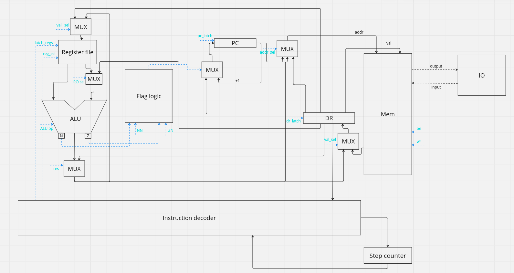

# CSA lab 3
Выполнил Рогачев Михаил Сергеевич P33082
- `lisp -> asm | cisc -> risc | neum | hw | instr | binary -> struct | stream | mem | pstr | prob1 | [4]char`
- С упрощением


## Язык программирования
Разработанный язык напоминает ассемблер

Программа всегда должна содержать section .text и метку .start, section .data - опциональный заголовок


``` ebnf
program ::= <section_text> <section_data> | <section_data> <section_text> | <section_text>
<section_data> ::= "section .data:" <variables>
<section_text> ::= "section .text:" <instructions>
<variables> ::= (<variable> | (<int> | <string>))
<instructions> ::= (<label> | <instruction>)
<name> ::= [a-zA-Z]+
<label> ::= "."<name> ":"
<variable> ::= <name> ":"
<reg=> ::= "r0" | "r1" | "r2" | "r3" | "r4" | "r5" | "r6" | "r7" | "r8 | "r9" | "r10" | "r11" | "r12" | "r14" | "r15""
<string> ::= '"' <character>, { <character> | <underscore> | " " } '"'
<char> ::= "'" ( <character> | "\0" | "\n" ) "'"
<int> ::= <digit>, { <digit> }
<digit> ::= "0" | "1" | "2" | "3" | "4" | "5" | "6" | "7" | "8" | "9"
bin_ops ::= ("CMP" | "LD" | "ST" | "MOV" | "ADD" | "CMP" | "DIV" | "MOD" | "XOR" ) " " ((<reg> ", " <reg>) | (<reg> ", " "(" <name> ")") | ("(" <name> ")" ", " <reg>))
un_ops ::= ("INC" | "DEC" | "NEG") " "  (<reg>)
branch ::= ("JUMP" | "JE" | "JG" | "JNE" | "JGE" ) " " (<label>)
zero_arg ::= ("HALT" | "NOP")
<instruction> ::= <bin_ops> | <un_ops> | branch | <zero_arg>
```

Пример программы:
```
section .text
    .start:
      ld r1 [INP]
      ld r3 0
    .loop:
      cmp r1 r3
      je .end
      ld r2 [INP]
      st r2 [OUT]
      dec r1
      jump .loop
    .end:
      halt
```


## Организация памяти

Модель памяти процессора:

Память(общая). Машинное слово -- 32 бита, реализуется списком объектов класса Word.
Данные лежат там же, но вместо их опкода поставлена заглушка (NOP)

Память начинается с ячеек памяти, зарезервированных для взаимодействия с io.
Далее находятся исполняемые инструкции
Далее в статической памяти лежат строки в паскальном представлении или необходимые переменные, объявленные в программе.
В общем схема выглядит следующим образом:
```
    +-----------------+
    |        IO       |
    +-----------------+
    |       CODE      |
    |                 |
    |                 |
    +-----------------+
    |   STATIC_DATA   |
    |                 |
    |                 |
    +-----------------+
  

```

Так как до конца компиляции размер программы неизвестен, а следовательно, и начало статической памяти, везде, где нужны адреса строк, ставятся заглушки, которые потом резолвятся.

Числовые литералы загружаются непосредственно с помощью операции LD_LIT. Так как операций со строками нет(кроме чтения), то все строки - это константы, лежащие в статической памяти.


## Система команд

Особенности процессора:

- Машинное слово -- 32 бита, знаковое.
- Поток управления:
    - инкремент `PC` после каждой инструкции;
    - условные и безусловные переходы.
У команды может быть до двух аргументов.

### Набор инструкций
| Инструкция | Кол-во тактов | операнды       | Пояснение                                          |
|:-----------|---------------|:---------------|:---------------------------------------------------|
| ST_ADDR    | 4             | 2 (reg, int)   | Прямая адресация                                   |
| ST         | 5             | 2 (reg, reg)   | Косвенная адресация - в левый по адресу из правого |
| LD_ADDR    | 3             | 2 (reg, int)   | Прямая адресация                                   |
| LD_LIT     | 2             | 2 (reg, int)   | Загрузка литерала                                  |
| LD         | 4             | 2 (reg, reg)   | Косвенная адресация                                |
| MV         | 3             | 2 (reg, reg)   |                                                    |
| JLE        | 3             | 1 (addr)       |                                                    |
| JL         | 3             | 1 (addr)       |                                                    |
| JGE        | 3             | 1 (addr)       |                                                    |
| JG         | 3             | 1 (addr)       |                                                    |
| JNE        | 3             | 1 (addr)       |                                                    |
| JE         | 3             | 1 (addr)       |                                                    |
| JUMP       | 3             | 1 (addr)       |                                                    |
| ADD        | 3             | 2 (reg, reg)   |                                                    |
| ADD_LIT    | 2             | 2 (reg, val)   |                                                    |
| NEG        | 2             | 1 (reg)        |                                                    |
| AND        | 3             | 2 (reg, reg)   |                                                    |
| OR         | 3             | 2 (reg, reg)   |                                                    |
| XOR        | 3             | 2 (reg, reg)   |                                                    |
| SUB        | 4             | 2 (reg, reg)   |                                                    |
| DIV        | 4             | 2 (reg, reg)   |                                                    |
| MOD        | 4             | 2 (reg, reg)   |                                                    |
| CMP        | 4             | 2 (reg1, reg2) |                                                    |
| INC        | 3             | 1 (reg)        |                                                    |
| DEC        | 3             | 1 (reg)        |                                                    |
| HALT       | 0             | 0              |                                                    |


### Кодирование инструкций

- Машинный код сериализуется в список JSON.
- Один элемент списка -- одна инструкция.
- Индекс списка -- адрес инструкции. Используется для команд перехода.

Пример:

```json
[
    {"index": 209, "opcode": "JUMP", "arg1": 0, "arg2": 0}
]
```

где:

- `opcode` -- строка с кодом операции;
- `arg1`, `arg2` -- аргументы (могут отсутствовать);
- `index` -- адрес.

Типы данных в модуле [machine](./machine/isa.py), где:

- `Opcode` -- перечисление кодов операций;

## Транслятор

Интерфейс командной строки: `translator.py <input_file> <target_file>`

Реализовано в модуле: [translator](./interpreter/translator.py)

Этапы трансляции (функция `translate`):

1. Преобразуется секция .data, если она есть в список машинных слов
2. Преобразуется секция .text в список машинных инструкций
3. Происходит подстановка необходимых значений на этапе компиляции

Правила генерации машинного кода:

Все инструкции генерируются исходя из инструкции почти напрямую(существуют инструкции, которые детализируются):

- LD -> LD_LIT, LD_ADDR, LD - зависит от второго аргумента
- ST -> ST_ADDR, ST - аналогично LD


## Модель процессора

Интерфейс командной строки: `machine.py <machine_code_file> <input_file>`

Реализовано в модуле: [machine](./emulator.py).

Было принято решение не разделять DataPath и ControlUnit на схеме из-за использования одной и той же памяти и там, и там, и неудобства
изображения схемы.



Модель процессора имеет 16 регистров:
```
r0 - r12 - регистры общего назначения

r13- program counter

r14 - DR - значение для записи/сохраненное после чтения в память

r15 - stack pointer
```

Ввод и вывод осуществляется через память

Сигналы и селекторы - oe, wr - чтение, запись из памяти

RO sel - выбор источника правого операнда

ALU op - выбор операции алу

res - выбор источника для данных(из алу, памяти, или устройства ввода)

ZN - 1, если zero не необходим, 0 иначе

NN - 1, если neg не необходим, 0 иначе

latch_reg_NUM - защелкнуть регистр

reg sel - выбрать регистр из регистрового файла


- Цикл симуляции осуществляется в функции `simulation`.
- Шаг моделирования соответствует одной инструкции с выводом состояния в журнал.
- Для журнала состояний процессора используется стандартный модуль `logging`.
- Количество инструкций для моделирования лимитировано.

## Тестирование

В качестве тестов использовано 6 алгоритмов:
1. [hello world](golden/hello_world.yml).
2. [cat](golden/cat.yml) -- программа `cat`, повторяем ввод на выводе.
3. [hello user](golden/hello_user.yml). - приветствие пользователя
5. [prob1](golden/prob1.yml). - prob1

Рассмотрим алгоритм Hello World. Исходный код выглядит следующим образом
```
  section .data
    hello_str: "Hello, World!"
  section .text
    .start:
      ld r1 hello_str
      ld r2 [hello_str]
      ld r3 0
    .loop:
      cmp r2 r3
      je .end
      inc r1
      dec r2
      ld r4 r1
      st r4 [OUT]
      jump .loop
    .end:
      halt
```
После компиляции
```
  [{"index": 0, "opcode": "NOP", "arg1": 0, "arg2": 0},
   {"index": 1, "opcode": "NOP", "arg1": 0, "arg2": 0},
   {"index": 2, "opcode": "LD_LIT", "arg1": "r1", "arg2": 13},
   {"index": 3, "opcode": "LD_ADDR", "arg1": "r2", "arg2": 13},
   {"index": 4, "opcode": "LD_LIT", "arg1": "r3", "arg2": 0},
   {"index": 5, "opcode": "CMP", "arg1": "r2", "arg2": "r3"},
   {"index": 6, "opcode": "JE", "arg1": 12, "arg2": 0},
   {"index": 7, "opcode": "INC", "arg1": "r1", "arg2": 0},
   {"index": 8, "opcode": "DEC", "arg1": "r2", "arg2": 0},
   {"index": 9, "opcode": "LD", "arg1": "r4", "arg2": "r1"},
   {"index": 10, "opcode": "ST_ADDR", "arg1": "r4", "arg2": 1},
   {"index": 11, "opcode": "JUMP", "arg1": 5, "arg2": 0},
   {"index": 12, "opcode": "HALT", "arg1": 0, "arg2": 0},
   {"index": 13, "opcode": "NOP", "arg1": 12, "arg2": 0},
   {"index": 14, "opcode": "NOP", "arg1": 72, "arg2": 0},
   {"index": 15, "opcode": "NOP", "arg1": 101, "arg2": 0},
   {"index": 16, "opcode": "NOP", "arg1": 108, "arg2": 0},
   {"index": 17, "opcode": "NOP", "arg1": 108, "arg2": 0},
   {"index": 18, "opcode": "NOP", "arg1": 111, "arg2": 0},
   {"index": 19, "opcode": "NOP", "arg1": 32, "arg2": 0},
   {"index": 20, "opcode": "NOP", "arg1": 87, "arg2": 0},
   {"index": 21, "opcode": "NOP", "arg1": 111, "arg2": 0},
   {"index": 22, "opcode": "NOP", "arg1": 114, "arg2": 0},
   {"index": 23, "opcode": "NOP", "arg1": 108, "arg2": 0},
   {"index": 24, "opcode": "NOP", "arg1": 100, "arg2": 0},
   {"index": 25, "opcode": "NOP", "arg1": 33, "arg2": 0}]
```

В начале располагаются инструкции для выполнения. После них - статическая память. Сама строка лежит после этой памяти.

журнал выглядит следующим образом:

```
  DEBUG emulator:simulation TICK:   0 PC:   0  MEM_OUT: 0 0 reg: 'r0': 0, 'r1': 0, 'r2': 0, 'r3': 0, 'r4': 0, 'r5': 0, 'r6': 0, 'r7': 0, 'r8': 0, 'r9': 0, 'r10': 0, 'r11': 0, 'r12': 0, 'r13': 0, 'r14': 0, 'r15': 4095 	  ('0'@Opcode.NOP:0 0)
  DEBUG emulator:simulation TICK:   2 PC:   1  MEM_OUT: 0 0 reg: 'r0': 0, 'r1': 0, 'r2': 0, 'r3': 0, 'r4': 0, 'r5': 0, 'r6': 0, 'r7': 0, 'r8': 0, 'r9': 0, 'r10': 0, 'r11': 0, 'r12': 0, 'r13': 1, 'r14': 0, 'r15': 4095 	  ('1'@Opcode.NOP:0 0)
  DEBUG emulator:simulation TICK:   4 PC:   2  MEM_OUT: r1 13 reg: 'r0': 0, 'r1': 0, 'r2': 0, 'r3': 0, 'r4': 0, 'r5': 0, 'r6': 0, 'r7': 0, 'r8': 0, 'r9': 0, 'r10': 0, 'r11': 0, 'r12': 0, 'r13': 2, 'r14': 0, 'r15': 4095 	  ('2'@Opcode.LD_LIT:Register.r1 13)
  DEBUG emulator:simulation TICK:   7 PC:   3  MEM_OUT: r2 13 reg: 'r0': 0, 'r1': 13, 'r2': 0, 'r3': 0, 'r4': 0, 'r5': 0, 'r6': 0, 'r7': 0, 'r8': 0, 'r9': 0, 'r10': 0, 'r11': 0, 'r12': 0, 'r13': 3, 'r14': Register.r1, 'r15': 4095 	  ('3'@Opcode.LD_ADDR:Register.r2 13)
  DEBUG emulator:simulation TICK:  11 PC:   4  MEM_OUT: r3 0 reg: 'r0': 0, 'r1': 13, 'r2': 12, 'r3': 0, 'r4': 0, 'r5': 0, 'r6': 0, 'r7': 0, 'r8': 0, 'r9': 0, 'r10': 0, 'r11': 0, 'r12': 0, 'r13': 4, 'r14': 12, 'r15': 4095 	  ('4'@Opcode.LD_LIT:Register.r3 0)
  DEBUG emulator:simulation TICK:  14 PC:   5  MEM_OUT: r2 r3 reg: 'r0': 0, 'r1': 13, 'r2': 12, 'r3': 0, 'r4': 0, 'r5': 0, 'r6': 0, 'r7': 0, 'r8': 0, 'r9': 0, 'r10': 0, 'r11': 0, 'r12': 0, 'r13': 5, 'r14': Register.r3, 'r15': 4095 	  ('5'@Opcode.CMP:Register.r2 Register.r3)
  DEBUG emulator:simulation TICK:  17 PC:   6  MEM_OUT: 12 0 reg: 'r0': 0, 'r1': 13, 'r2': 12, 'r3': 0, 'r4': 0, 'r5': 0, 'r6': 0, 'r7': 0, 'r8': 0, 'r9': 0, 'r10': 0, 'r11': 0, 'r12': 0, 'r13': 6, 'r14': Register.r2, 'r15': 4095 	  ('6'@Opcode.JE:12 0)
  DEBUG emulator:simulation TICK:  19 PC:   7  MEM_OUT: r1 0 reg: 'r0': 0, 'r1': 13, 'r2': 12, 'r3': 0, 'r4': 0, 'r5': 0, 'r6': 0, 'r7': 0, 'r8': 0, 'r9': 0, 'r10': 0, 'r11': 0, 'r12': 0, 'r13': 7, 'r14': 12, 'r15': 4095 	  ('7'@Opcode.INC:Register.r1 0)
  DEBUG emulator:simulation TICK:  22 PC:   8  MEM_OUT: r2 0 reg: 'r0': 0, 'r1': 14, 'r2': 12, 'r3': 0, 'r4': 0, 'r5': 0, 'r6': 0, 'r7': 0, 'r8': 0, 'r9': 0, 'r10': 0, 'r11': 0, 'r12': 0, 'r13': 8, 'r14': Register.r1, 'r15': 4095 	  ('8'@Opcode.DEC:Register.r2 0)
  DEBUG emulator:simulation TICK:  25 PC:   9  MEM_OUT: r4 r1 reg: 'r0': 0, 'r1': 14, 'r2': 11, 'r3': 0, 'r4': 0, 'r5': 0, 'r6': 0, 'r7': 0, 'r8': 0, 'r9': 0, 'r10': 0, 'r11': 0, 'r12': 0, 'r13': 9, 'r14': Register.r2, 'r15': 4095 	  ('9'@Opcode.LD:Register.r4 Register.r1)
  DEBUG emulator:simulation TICK:  30 PC:  10  MEM_OUT: r4 1 reg: 'r0': 0, 'r1': 14, 'r2': 11, 'r3': 0, 'r4': 72, 'r5': 0, 'r6': 0, 'r7': 0, 'r8': 0, 'r9': 0, 'r10': 0, 'r11': 0, 'r12': 0, 'r13': 10, 'r14': 72, 'r15': 4095 	  ('10'@Opcode.ST_ADDR:Register.r4 1)
  DEBUG emulator:memory_perform output: '' <- 'H'
  DEBUG emulator:simulation TICK:  35 PC:  11  MEM_OUT: 5 0 reg: 'r0': 0, 'r1': 14, 'r2': 11, 'r3': 0, 'r4': 72, 'r5': 0, 'r6': 0, 'r7': 0, 'r8': 0, 'r9': 0, 'r10': 0, 'r11': 0, 'r12': 0, 'r13': 11, 'r14': 72, 'r15': 4095 	  ('11'@Opcode.JUMP:5 0)
  DEBUG emulator:simulation TICK:  37 PC:   5  MEM_OUT: r2 r3 reg: 'r0': 0, 'r1': 14, 'r2': 11, 'r3': 0, 'r4': 72, 'r5': 0, 'r6': 0, 'r7': 0, 'r8': 0, 'r9': 0, 'r10': 0, 'r11': 0, 'r12': 0, 'r13': 5, 'r14': 5, 'r15': 4095 	  ('5'@Opcode.CMP:Register.r2 Register.r3)
  DEBUG emulator:simulation TICK:  40 PC:   6  MEM_OUT: 12 0 reg: 'r0': 0, 'r1': 14, 'r2': 11, 'r3': 0, 'r4': 72, 'r5': 0, 'r6': 0, 'r7': 0, 'r8': 0, 'r9': 0, 'r10': 0, 'r11': 0, 'r12': 0, 'r13': 6, 'r14': Register.r2, 'r15': 4095 	  ('6'@Opcode.JE:12 0)
  DEBUG emulator:simulation TICK:  42 PC:   7  MEM_OUT: r1 0 reg: 'r0': 0, 'r1': 14, 'r2': 11, 'r3': 0, 'r4': 72, 'r5': 0, 'r6': 0, 'r7': 0, 'r8': 0, 'r9': 0, 'r10': 0, 'r11': 0, 'r12': 0, 'r13': 7, 'r14': 12, 'r15': 4095 	  ('7'@Opcode.INC:Register.r1 0)
  DEBUG emulator:simulation TICK:  45 PC:   8  MEM_OUT: r2 0 reg: 'r0': 0, 'r1': 15, 'r2': 11, 'r3': 0, 'r4': 72, 'r5': 0, 'r6': 0, 'r7': 0, 'r8': 0, 'r9': 0, 'r10': 0, 'r11': 0, 'r12': 0, 'r13': 8, 'r14': Register.r1, 'r15': 4095 	  ('8'@Opcode.DEC:Register.r2 0)
  DEBUG emulator:simulation TICK:  48 PC:   9  MEM_OUT: r4 r1 reg: 'r0': 0, 'r1': 15, 'r2': 10, 'r3': 0, 'r4': 72, 'r5': 0, 'r6': 0, 'r7': 0, 'r8': 0, 'r9': 0, 'r10': 0, 'r11': 0, 'r12': 0, 'r13': 9, 'r14': Register.r2, 'r15': 4095 	  ('9'@Opcode.LD:Register.r4 Register.r1)
  DEBUG emulator:simulation TICK:  53 PC:  10  MEM_OUT: r4 1 reg: 'r0': 0, 'r1': 15, 'r2': 10, 'r3': 0, 'r4': 101, 'r5': 0, 'r6': 0, 'r7': 0, 'r8': 0, 'r9': 0, 'r10': 0, 'r11': 0, 'r12': 0, 'r13': 10, 'r14': 101, 'r15': 4095 	  ('10'@Opcode.ST_ADDR:Register.r4 1)
  DEBUG emulator:memory_perform output: 'H' <- 'e'
```
Интеграционные тесты реализованы в [integration_test](./integration_test.py) через golden tests, конфигурация которых лежит в папке [golden](./golden).

CI:

``` yaml
name: CI

on:
  push:
    branches: [ "main" ]
  pull_request:
    branches: [ "main" ]

permissions:
  contents: read

jobs:
  lint:
    runs-on: ubuntu-latest

    steps:
    - uses: actions/checkout@v4
    - name: Install poetry
      run: pip install poetry
    - name: Set up Python 3.12
      uses: actions/setup-python@v4
      with:
        python-version: "3.12"
        cache: "poetry"
    - name: Install project
      run: |
        poetry install
    - name: Lint with ruff
      run: |
        poetry run python -m ruff interpreter
        poetry run python -m ruff machine
  test:
    runs-on: ubuntu-latest
    steps:
    - uses: actions/checkout@v4
    - name: Install poetry
      run: pip install poetry
    - name: Set up Python 3.12
      uses: actions/setup-python@v4
      with:
        python-version: "3.12"
        cache: "poetry"
    - name: Install project
      run: |
        poetry install
    - name: Run tests
      run: |
        poetry run pytest . -v --update-goldens
    needs: lint
```
- `poetry` -- управления зависимостями для языка программирования Python.
- `pytest` -- утилита для запуска тестов.
- `ruff` -- утилита для форматирования и проверки стиля кодирования.

Пример проверки исходного кода:

``` shell
(csa-lab3-py3.12) PS C:\Users\Huawei\PycharmProjects\CSA3_simple> poetry run pytest . -v --update-goldens
=============================================================================== test session starts ===============================================================================
platform win32 -- Python 3.12.0, pytest-7.4.4, pluggy-1.4.0 -- C:\Users\Huawei\AppData\Local\pypoetry\Cache\virtualenvs\csa-lab3-UxNP5vq3-py3.12\Scripts\python.exe
cachedir: .pytest_cache
rootdir: C:\Users\Huawei\PycharmProjects\CSA3_simple
configfile: pyproject.toml
plugins: golden-0.2.2
collected 4 items                                                                                                                                                                  

integration_test.py::test_translator_and_machine[golden/cat.yml] PASSED                                                                                                      [ 25%]
integration_test.py::test_translator_and_machine[golden/hello_user.yml] PASSED                                                                                               [ 50%]
integration_test.py::test_translator_and_machine[golden/hello_world.yml] PASSED                                                                                              [ 75%]
integration_test.py::test_translator_and_machine[golden/prob1.yml] PASSED                                                                                                    [100%]

================================================================================ 4 passed in 3.69s ================================================================================ 
```

```text
| ФИО                            | алг        | LoC |  code byte  | code instr | instr count | ticks | var
| Рогачев Михаил Сергеевич       | hello      | 17  | -           | 26         | 91          | 296   | lisp -> asm | cisc -> risc | neum | hw | instr | binary -> struct | stream | mem | pstr | prob1 | [4]char
| Рогачев Михаил Сергеевич       | prob_1     | 25  | -           | 22         | 10132       | 31063 | lisp -> asm | cisc -> risc | neum | hw | instr | binary -> struct | stream | mem | pstr | prob1 | [4]char
| Рогачев Михаил Сергеевич       | hello_user | 62  | -           | 80         | 251         | 882   | lisp -> asm | cisc -> risc | neum | hw | instr | binary -> struct | stream | mem | pstr | prob1 | [4]char

```

